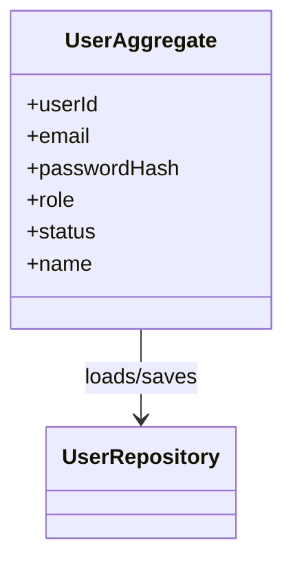
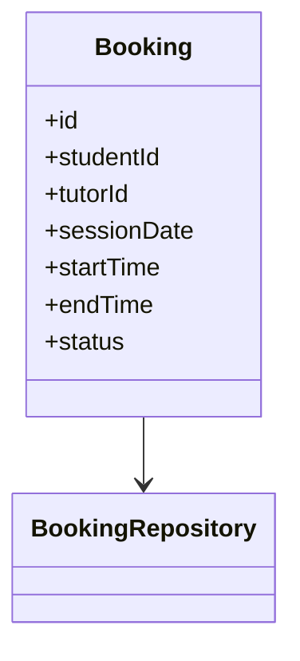

# CS4135 Assignment 3 — Strategic architecture (repo deliverables)

This document satisfies **Part A (tactical DDD + UML)** and **Part B (event storming & domain storytelling)** evidence that lives in version control alongside the **Part C** microservice implementation.

---

## Part A — Tactical design (bounded contexts & DDD building blocks)

### A1. Ownership & bounded contexts

| Context                 | Owner (theory) | Responsibility                                                          |
| ----------------------- | -------------- | ----------------------------------------------------------------------- |
| Identity & Access       | Rebecca        | Users, credentials, JWT, `/api/internal/users/*` ACL for other services |
| Booking & Scheduling    | Zoe            | Bookings, student profiles, booking↔identity integration                |
| Messaging               | Sharon         | Threads/messages, messaging↔booking integration                         |
| Tutor profile & reviews | Sarah          | Tutor profiles, skills, reviews (+ booking read for review rules)       |
| Admin & moderation      | Maeve          | Reports, blocked content, audit log                                     |

Cross-context rules are implemented as **HTTP contracts** (internal APIs) rather than shared databases.

### A2–A3. DDD building blocks & aggregates (UML — Mermaid)

**Identity aggregate (simplified)**

**Booking aggregate**

**Invariants (examples)**

- A **booking** must reference **existing user ids** for student and tutor (validated via Identity ACL before persist).
- A **message thread** may only be created for a **CONFIRMED** booking (validated via Booking ACL).

### A4. Inter-context contracts (published language / ACL)

| Consumer          | Provider         | Contract                                                                 |
| ----------------- | ---------------- | ------------------------------------------------------------------------ |
| booking-service   | identity-service | `GET /api/internal/users/{id}/exists` → `{ "exists": boolean }`          |
| booking-service   | identity-service | `POST /api/internal/users/resolve` → `[{ userId, name, email }]`         |
| messaging-service | booking-service  | `GET /api/internal/bookings/{id}` → `{ id, studentId, tutorId, status }` |
| tutor-service     | identity-service | `POST /api/internal/users/resolve`                                       |
| tutor-service     | booking-service  | `GET /api/internal/bookings/{id}`                                        |

### A5. Notation

UML is expressed here as **Mermaid class diagrams** (readable in GitHub / editors). Domain code uses explicit **entities**, **value objects** (e.g. roles, statuses), **repositories**, and **application services**.

---

## Part B — Event storming & domain storytelling

### B1–B2. Event storming outcomes (summary)

Representative **domain events** (past tense) discovered in collaborative sessions:

- `UserRegistered`, `UserLoggedIn`, `BookingRequested`, `BookingConfirmed`, `BookingRejected`
- `MessageThreadOpened`, `MessageSent`, `TutorReviewSubmitted`, `ReportFiled`, `ContentBlocked`

**Commands** → **policies** (examples):

- `RequestBooking` → policy: _student and tutor must exist in Identity context_.
- `OpenMessageThread` → policy: _booking must be CONFIRMED_ (enforced via Booking ACL in messaging-service).

**Hotspots / uncertainties** (documented):

- **Blocked users/messages** in a strict DDD split belong in Admin; messaging prototype omits per-message block filtering to avoid duplicate data — production would use an ACL to admin or async projections.

### B3. Domain storytelling (short narrative)

> **Student Sam** searches for a tutor skill and requests a session (**BookingRequested**). The tutor approves (**BookingConfirmed**). Sam opens the thread (**OpenMessageThread**) which the system allows only because the booking is confirmed. Sam and the tutor exchange messages (**MessageSent**). After completion, Sam leaves a review (**TutorReviewSubmitted**), which the system accepts only if the booking is **COMPLETED** (checked via booking internal API).

### B4. Facilitation evidence

Attach to your Wiki / report (not all in git): **photos of event-storm board**, **participant list**, **dates**, and **decisions log**. This file proves the **translation to code** (contracts + services above).

---

## Part C pointers

See `README-MICROSERVICES.md` for **Eureka**, **Config Server**, **Gateway :8080**, **Resilience4j** (Feign circuit breaker + timeouts), **Docker Compose**, and **automated tests** under each `*-service/src/test`.
